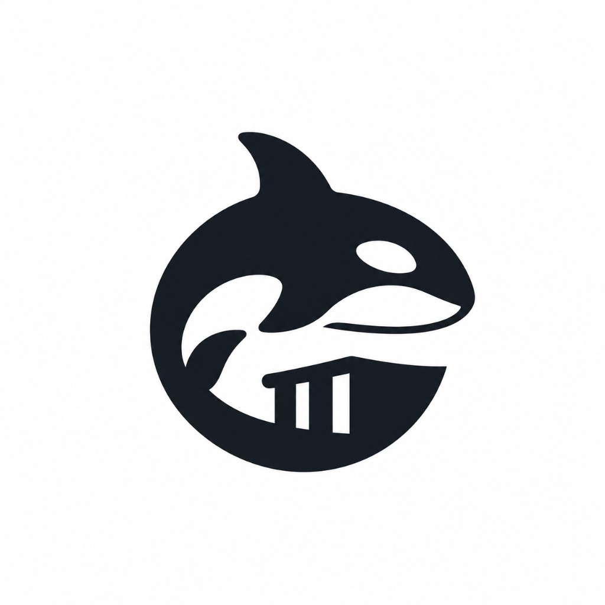
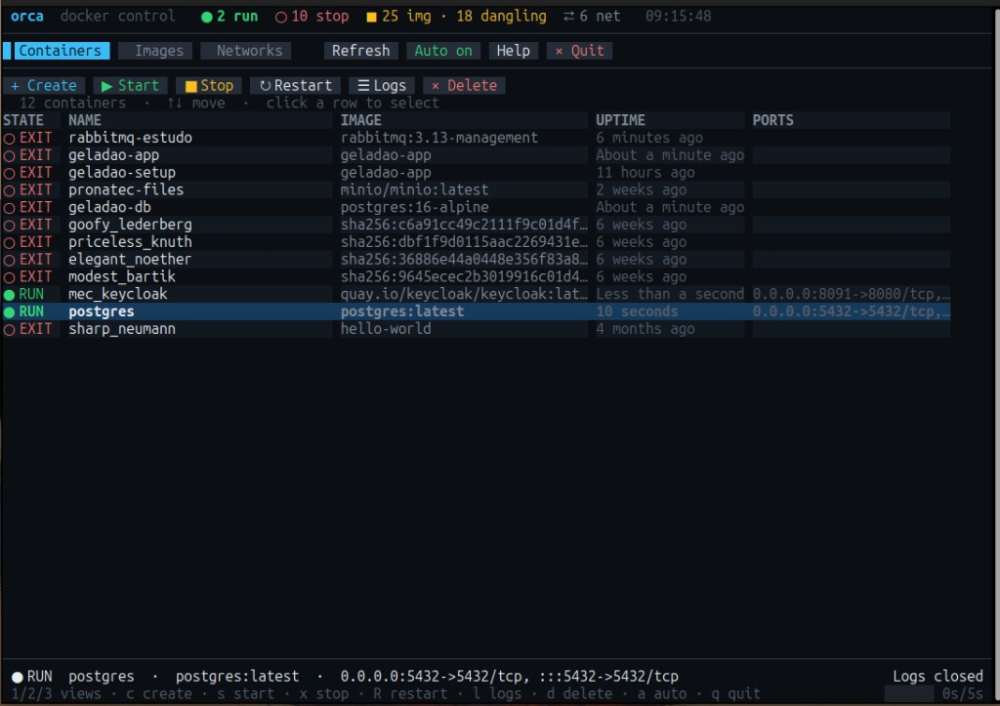

<p align="center">
  
</p>

<h1 align="center">orca</h1>

<p align="center">
  <strong>A modern, clickable terminal UI for Docker</strong><br />
  Manage containers, images, and networks with mouse and keyboard.
</p>

<p align="center">
  <a href="#features">Features</a> ·
  <a href="#requirements">Requirements</a> ·
  <a href="#install">Install</a> ·
  <a href="#usage">Usage</a> ·
  <a href="#mouse--keyboard">Controls</a> ·
  <a href="#contributing">Contributing</a>
</p>

---

**orca** is a lightweight Docker TUI written in Java. It talks to the Docker Engine API and renders a dark, high-contrast interface where you can **click tabs, buttons, and table rows** — while keeping keyboard shortcuts for power users.

Mouse support uses modern **SGR mouse tracking** (`CSI ?1006h`). Prefer a real terminal emulator (GNOME Terminal, Kitty, Alacritty, iTerm2, Windows Terminal). Some IDE embedded terminals do not forward mouse events.

<p align="center">
  
  <br />
  <em>Containers view with live KPIs, colour-coded state badges, and clickable toolbar.</em>
</p>

## Features

- **Mouse-first navigation** — click tabs, action buttons, and rows
- Browse **containers**, **images**, and **networks** in dedicated views
- Create, start, stop, restart, and remove containers
- View container logs in-place
- Pull and remove images
- Create and remove networks
- Modern dark theme with clear selection feedback
- Friendly status messages when Docker is unreachable

## Requirements

- **JDK 21+** to build, **Java 21+** runtime to run
- A running **Docker** daemon (`DOCKER_HOST` or `/var/run/docker.sock`)
- A terminal emulator with mouse reporting (most modern ones: GNOME Terminal, Kitty, Alacritty, iTerm2, Windows Terminal, …)

## Install

```bash
git clone https://github.com/<your-user>/orca.git
cd orca
./install.sh
```

This builds the fat JAR and installs it as the `orca` command in `~/.local/bin`
(set `PREFIX` to install somewhere else). If the installer warns that the directory
is not on your `PATH`:

```bash
echo 'export PATH="$HOME/.local/bin:$PATH"' >> ~/.bashrc && source ~/.bashrc
```

## Usage

```bash
orca
```

That's it — the interface opens in the current terminal and both mouse and keyboard work.
Press `q` (or click **Quit**) to leave.

To run without installing:

```bash
./mvnw package -DskipTests
./bin/orca
```

If your user cannot access the Docker socket, either join the `docker` group or set `DOCKER_HOST`.

### Create container fields

| Field | Description |
|-------|-------------|
| **Image** | Required. Example: `nginx:alpine` |
| **Name** | Optional container name |
| **Ports** | `8080:80` or `80` (comma-separated) |
| **Env** | `KEY=value,KEY2=value` |
| **Command** | Space-separated command override |

## Mouse & keyboard

### Mouse

| Action | How |
|--------|-----|
| Switch views | Click **Containers** / **Images** / **Networks** |
| Run actions | Click toolbar buttons (`Create`, `Start`, `Stop`, …) |
| Select a row | Click a table row |
| Dialogs | Click dialog buttons (`Create`, `Cancel`, `Yes`, …) |
| Copy text | Hold **Shift** while selecting (most terminals) |

> Mouse capture is enabled automatically. Hold **Shift** to select/copy text without sending clicks to the app.

### Keyboard shortcuts

#### Global

| Key | Action |
|-----|--------|
| `1` / `2` / `3` | Switch to Containers / Images / Networks |
| `↑` / `↓` | Move the row selection |
| `Tab` | Move focus between buttons and the table |
| `r` | Refresh the current tab |
| `?` | Show help |
| `q` | Quit |

#### Containers

| Key | Action |
|-----|--------|
| `c` | Create and start a container |
| `s` | Start |
| `x` | Stop |
| `R` | Restart |
| `l` | View logs |
| `d` | Delete (force) |

#### Images

| Key | Action |
|-----|--------|
| `p` | Pull an image |
| `d` | Delete (force) |

#### Networks

| Key | Action |
|-----|--------|
| `c` | Create a network |
| `d` | Delete a network |

## Tech stack

| Layer | Library |
|-------|---------|
| TUI | [Lanterna](https://github.com/mabe02/lanterna) (mouse capture + themed GUI) |
| Docker client | [docker-java](https://github.com/docker-java/docker-java) |
| Language | Java 21 |
| Build | Maven |

## Project layout

```text
bin/orca                  # Launcher script
install.sh                # Build + install the `orca` command
src/main/java/dev/orca/
├── OrcaApp.java          # Entry point
├── docker/               # Docker client + service layer
├── model/                # View models
└── ui/                   # Terminal, mouse decoding, theme, window, panels, dialogs
```

## Contributing

Contributions are welcome. Open an issue to discuss larger changes, or submit a pull request with a focused fix or feature.

1. Fork the repository
2. Create a branch (`git checkout -b feature/my-change`)
3. Commit your changes
4. Push and open a pull request

## License

This project is released under the [MIT License](LICENSE) — free to use, modify, and distribute.

---

<p align="center">
  Made for people who live in the terminal.
</p>
